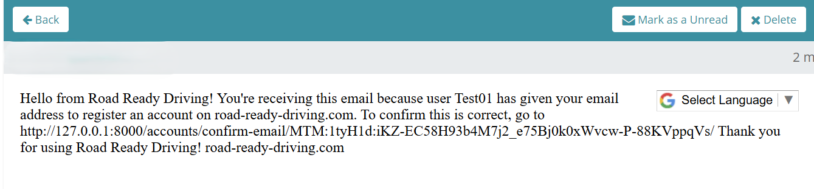

# Road Ready Driving 🚗

Welcome to **Road Ready Driving** a responsive, full-stack web application designed for booking professional driving lessons through a flexible and user-friendly platform. Built as part of an educational project, this app demonstrates real-world e-commerce functionality including Stripe integration, dynamic content management, and custom admin features tailored for managing instructors and packages.


**🔗 Live Site:** [Road Ready Driving](https://road-ready-driving-62655dbfb1ed.herokuapp.com/)  
**📁 Repository:** [GitHub Repo](https://github.com/OJarvey/Road-Ready-Driving.git)

---

## 📚 Table of Contents

1. [Introduction](#introduction)
   - [Objective](#objective)
   - [Audience](#audience)
   - [Solution](#solution)
   - [Scope](#scope)

2. [Business and Marketing Plan](#business-and-marketing-plan)
   - [Business Objectives](#business-objectives)
   - [User Experience (UX) Strategy](#user-experience-ux-strategy)
   - [Target Market](#target-market)
   - [Revenue Model](#revenue-model)
   - [Marketing Strategy](#marketing-strategy)
   - [Growth Opportunities](#growth-opportunities)

3. [Design](#design)
   - [Color Scheme](#color-scheme)
   - [Typography](#typography)
   - [Favicons](#favicons)
   - [Background Image](#background-image)
   - [Wireframes](#wireframes)
   - [Data Structure](#data-structure)

4. [Features](#features)
   - [General Features](#general-features)
   - [Packages](#packages)
   - [Bag](#bag)
   - [Account Management](#account-management)
   - [End-User Features](#end-user-features)
   - [Staff/Admin Features](#staffadmin-features)
   - [Developer/Tester Features](#developertester-features)
   - [User Flow Confirmations & Notifications](#user-flow-confirmations--notifications)

5. [Testing and Validation](#testing-and-validation)

6. [SEO and Marketing Features](#seo-and-marketing-features)
   - [Sitemap.xml](#sitemapxml)
   - [Robots.txt](#robotstxt)
   - [Dynamic Page Titles](#dynamic-page-titles)
   - [Meta Tags](#meta-tags)
   - [Facebook Business Page](#facebook-business-page)
   - [Newsletter Subscription](#newsletter-subscription)

7. [Future Features](#future-features)

8. [Technology Used](#technology-used)
   - [Languages](#languages)
   - [Frameworks, Libraries, and Tools](#frameworks-libraries-and-tools)

9. [Development Process](#development-process)

10. [License](#license)

11. [Credits](#credits)

---

## 🧭 Introduction

### Objective
The goal is to create a real-world driving lesson booking platform with intuitive design, full e-commerce flow, and dynamic content management.

### Audience
- New drivers and learners
- Parents booking for teens
- Adults returning to driving
- Developers & recruiters reviewing educational work

### Solution
A secure, user-friendly platform with tutor management, bag and checkout system, Stripe integration, and more.

### Scope
Includes:
- Package filtering & detail view
- Profile dashboard
- Shopping bag and checkout
- Tutor CRUD features (admin only)
- Contact form & email alerts
- Custom toasts and mobile support

⚠️ For educational demonstration purposes only.

---

## 💼 Business and Marketing Plan

### Business Objectives
- Simple, modern online booking experience
- Scalable packages: Bronze, Silver, Gold
- Administrative tools for instructors and bookings

### User Experience (UX) Strategy
- Custom toasts for feedback
- Responsive sidebar navigation
- Accessible and clear forms
- AJAX submission for smoother interactions

### Target Market
- **Primary**: Teens & young adults (UK-based)
- **Secondary**: Adults needing refreshers
- **Tertiary**: Parents of learners

### Revenue Model
- Bronze: Basic hourly lessons
- Silver: More hours + theory prep
- Gold: Full course + mock tests
- Stripe checkout simulates real payments

### Marketing Strategy
- SEO with unique meta tags
- Facebook page to reach users
- Mailchimp newsletter signup in footer

<details>
<summary>📷 Facebook Page Screenshots</summary>


</details>

### Growth Opportunities
- Real tutor availability booking
- SMS/email lesson reminders
- Reviews & ratings
- Admin dashboard per driving school
- Native mobile app
- Live chat support

---

## 🎨 Design

### Color Scheme

<details>
<summary>🎨 Color Palette Visuals</summary>

The chosen color palette helps reinforce a professional yet friendly tone for the brand. It was inspired using [Coolors](https://coolors.co/)


<br/>


</details>

### Typography
- **Rubik** font for headings and body

### Favicons
<details>
<summary>🌐 Favicon Images</summary>

These favicon images represent the "Road Ready Driving" brand across various devices and browsers, ensuring consistent visual identity.

- **Android Chrome 192x192**  
  

- **Android Chrome 512x512**  
  

- **Apple Touch Icon**  
  

- **Favicon 16x16**  
  

- **Favicon 32x32**  
  

</details>

### Background Image
<details>
<summary>🖼️ Background Image</summary>

The background image enhances the visual appeal of the application, contributing to the overall user experience.

- **Background Image**  
  

</details>

## 📐 Wireframes

The following wireframes were used during the planning phase to guide the UI layout and responsive design strategy.

---

<details>
<summary>🏠 Home Page</summary>

**Desktop**  


**Mobile**  


</details>

<details>
<summary>📦 Packages</summary>

**Desktop**  


**Mobile**  


</details>

<details>
<summary>🛒 Shopping Bag</summary>

**Desktop**  


**Mobile**  


</details>

<details>
<summary>📭 Empty Bag</summary>


</details>

<details>
<summary>👤 Profile Page</summary>

**Desktop**  


**Mobile**  


</details>

<details>
<summary>🔑 Change Username</summary>

**Desktop**  


**Mobile**  


</details>

<details>
<summary>✉️ Change Email</summary>

**Desktop**  


**Mobile**  


</details>

<details>
<summary>🔐 Change Password</summary>

**Desktop**  


**Mobile**  


</details>

<details>
<summary>🗑️ Delete Profile</summary>

**Desktop**  


**Mobile**  


</details>

<details>
<summary>📥 Orders Overview</summary>

**Desktop**  


**Mobile**  


</details>

<details>
<summary>📃 Order Detail</summary>

**Desktop**  


**Mobile**  


</details>

<details>
<summary>📨 Contact Page</summary>

**Desktop**  


**Mobile**  


</details>

<details>
<summary>ℹ️ About Page</summary>

**Desktop**  


**Mobile**  


</details>

<details>
<summary>🚪 Logout Page</summary>

**Desktop**  


**Mobile**  


</details>

### Data Structure Diagram  
<details>  
<summary>🧩 Data Model Diagram</summary>

This visual diagram showcases the core relationships between models like `User`, `UserProfile`, `Order`, `Tutor`, and `Package`. It was planned to ensure clear data flow, scalability, and logical database structure.


</details>

## 🚀 Features

### General Features
- Home, About, Contact pages
- Responsive design
- Custom 404 error page
- Toast notifications

### Packages
- Filtering by keyword
- Detailed descriptions

<details>
<summary>📷 Package Tier Icons</summary>

These icons visually represent each of the three available driving lesson tiers: Bronze, Silver, and Gold. A fallback image is used when no icon is assigned.

- **Bronze Package**  
  

- **Silver Package**  
  

- **Gold Package**  
  

- **Default Placeholder (no image uploaded)**  
  

</details>

### Bag
- Add/remove/update items
- Total and summary display

### Account Management
- Sign up / login (Django Allauth)
- Profile updates (email, username)
- Delete account

### End-User Features
- Stripe checkout
- Mobile-friendly UI
- Email confirmation after order

### Staff/Admin Features

- Add/Edit/Delete **tutors** via a custom frontend dashboard  
- Admin-only access to tutor management view  
- Edit tutor details like name, experience, qualification, success rate, and image  
- Add/Edit/Delete **packages**  
- View and manage order history  
- Access Django admin for full backend control

### Tutor Cards  
<details>
<summary>📷 Tutor Card Designs (About Page)</summary>

These screenshots demonstrate how tutor information is visually presented using card components. Each card displays the tutor's name, image, and qualifications.

- Tutor 1  
  

- Tutor 2  
  

- Tutor 3  
  

- Tutor 4  
  

- Default Placeholder (when no image is uploaded)  
  

</details>

<details>
<summary>🛠️ Tutor Admin Management</summary>

These screenshots demonstrate the admin’s ability to manage tutors via a dedicated dashboard.

**Tutor Edit View**  


**Tutor Delete Confirmation**  


**Manage Tutors View**  


**Edit Tutor (Desktop)**  


</details>

### Button and UI Elements
<details>
<summary>🔘 Button and UI Elements</summary>

These screenshots highlight key interactive buttons and UI elements throughout the application, enhancing usability and navigation.

- **Account Dropdown**  
  

- **Account Delete Success Message**  
  

- **Back to Top Button**  
  

- **Delete Account Button**  
  

- **Delete Package Button**  
  

- **Edit Package Button**  
  

- **Footer**  
  

- **Menu Toggle**  
  

- **Package Hover Effect**  
  

- **Packages Sort By**  
  

- **Profile Button**  
  

- **Shopping Bag Button**  
  

- **Social Media Links**  
  

- **Update Username Warning**  
  

- **Update Username Success**  
  

</details>

---

### Visual Demonstrations  
<details>  
<summary>🖼️ Full Visual UI Showcase</summary>

This section presents real screenshots from the live site, illustrating core features, responsiveness, admin controls, and mobile interactions.

#### 🏠 Main Pages

**Main Page**  


**Header Navigation**  


**Home (Mobile)**  


**About Page (Desktop)**  


**About Page (Mobile)**  


**Contact Page (Desktop)**  


**Contact Page (Mobile)**  


---

#### 📦 Packages

**Packages Page (Desktop)**  


**Packages Page (Mobile)**  


**Package Detail (Desktop)**  


**Package Detail (Mobile)**  


**Edit Package (Desktop)**  


**Edit Package (Mobile)**  


**Add Package**  


---

#### 🛍️ Shopping Bag & Checkout

**Bag View (Desktop)**  


**Bag View (Mobile)**  


**Empty Bag Message**  


**Checkout Page**  


---

#### 👤 Accounts

**User Profile (Desktop)**  


**User Profile (Mobile)**  


**Change Username (Desktop)**  


**Change Username (Mobile)**  


**Change Password (Desktop)**  


**Change Password (Mobile)**  


**Change Email (Mobile)**  


**Logout (Mobile)**  


**Email Notification**  


---

#### 🧾 Orders

**Orders Page (Desktop)**  


**Orders Page (Mobile)**  


**Order Detail (Desktop)**  


**Order Detail (Mobile)**  


---

#### 🗑️ Delete Account

**Delete Account (Desktop)**  


**Delete Account (Mobile)**  


---

#### 🛠️ Tutor Management (Admin Only)

**Manage Tutors View**  


**Edit Tutor (Desktop)**  


**Edit Tutor (Mobile)**  


#### 🚫 Custom Error Pages
- **404 Page Not Found**
  

</details>

### Developer/Tester Features

- Custom toasts via Django messages
- AJAX form validation with JSON
- Reusable form templates and CSRF handling

### User Flow Confirmations & Notifications

<details>
<summary>✅ User Flow Confirmations & Notifications</summary>

These screenshots demonstrate the app’s custom toast messages, email confirmations, and user flow validation feedback throughout the platform.

#### 🛍️ Bag Actions

- **Add to Bag Notification**  
  

- **Remove from Bag Message**  
  

#### 📧 Email Confirmations

- **Email Sent After Sign-Up**  
  

- **Email Content Preview**  
  

- **Email Details Display**  
  

- **Link Clicked Confirmation Screen**  
  

#### 📦 Order Confirmation

- **Booking Success Message**  
  

- **Order Confirmation Email**  
  

#### 📰 Newsletter

- **Mailchimp Newsletter Signup Contact**  
  

#### 👤 Sign-Up and Login

- **Sign-Up Page (Desktop)**  
  

- **Sign-Up Page (Mobile)**  
  

- **Sign-In Page**  
  

#### 🔄 Success Toasts

- **Update Success Message**  
  

</details>

---

## 🧪 Testing and Validation

<details>
<summary>🧪 Validation Screenshots</summary>

These screenshots demonstrate the validation and testing performed on the application’s code and performance, ensuring quality and reliability.

- **Stripe Elements JS Validation**  
  

- **Script JS Validation**  
  

- **Profile JS Validation**  
  

- **Packages JS Validation**  
  

- **Footer CSS Validation**  
  

- **Lighthouse Performance Report**  
  

- **Checkout CSS Validation**  
  

- **Base JS Validation**  
  

- **Base CSS Validation**  
  

- **Bag JS Validation**  
  

- **Account Management CSS Validation**  
  

</details>

---

## 📈 SEO and Marketing Features

### Sitemap.xml

- The sitemap is like a roadmap for search engines, listing all the important pages on your site so they can be indexed quickly and efficiently. It works hand-in-hand with the robots.txt file to guide search engine crawlers to the right places. For simplicity, this file is served as a static resource.

### Robots.txt

- The robots.txt file helps manage how search engine crawlers interact with your site. It points them to the sitemap and politely asks them to avoid certain areas, like search results pages, to prevent unnecessary crawling. While it's not a strict rule (crawlers can choose to ignore it), it provides helpful guidance for optimizing how your site is indexed. Like the sitemap, this file is also served as a static resource.

### Dynamic Page Titles

- Every page has context-aware `<title>` blocks via Django templates

### Meta Tags

- Default and override tags set in `base.html`

### Facebook Business Page

- The Facebook page helps build trust and gives the brand a real presence online. It’s a place to share updates, post driving tips, connect with learners, and promote special offers. It also boosts visibility in search engines and adds a personal touch through photos and reviews.

### Newsletter Subscription

- The newsletter lets users stay in the loop with updates, offers, and tips. It’s powered by Mailchimp with double opt-in for GDPR compliance. The sign-up form is always visible in the footer, making it easy for users to subscribe from any page.

---

## 🔮 Future Features

- Calendar-based tutor booking
- Customer reviews and star ratings
- Google Maps integration
- Franchise-ready structure
- Mobile App version

---

## 🧰 Technology Used

### Languages

- HTML
- CSS
- JavaScript
- Python

### Frameworks, Libraries, and Tools

- Django
- Django Allauth
- Crispy Forms
- Bootstrap
- Stripe
- jQuery (AJAX, animations)
- AOS (Scroll animation)
- Cloudinary (Media)
- Mailchimp (Newsletter)
- Git + GitHub

---

## 🛠️ Development Process

<details>
<summary>📋 Agile Methodology</summary>

The project followed Agile methodology, with GitHub used to track tasks and progress. Development was driven by user stories, which were carefully prioritized and implemented to meet real user needs. These stories shaped the feature set and ensured the build remained user-focused and iterative throughout. These user stories, detailed below, guided the creation of features, ensuring a user-centric and incremental approach to building the "Road Ready Driving" website.

- **GitHub Agile Workflow**  
  

### User Stories

Below are the user stories that shaped the development of "Road Ready Driving," each with specific acceptance criteria and tasks to ensure deliverables met expectations.

#### Project Setup and Initial Configuration
**As a developer, I want to install Django within a Python virtual environment to ensure an isolated and controlled development environment.**
- **Acceptance Criteria:**
  - A Python virtual environment is created and activated.
  - Django is installed within the virtual environment.
  - The installation is verified by creating and running a basic Django project.
- **Tasks:**
  - Create a Python virtual environment using `venv`.
  - Activate the virtual environment.
  - Install Django using `pip install django`.
  - Verify the installation by creating a basic Django project with `django-admin startproject`.

#### Allauth Setup - User Registration and Authentication
**As a developer, I want to integrate Django Allauth so that users can register, log in, and manage their authentication securely.**
- **Acceptance Criteria:**
  - Django Allauth is installed and configured.
  - Users can register, log in, and reset their passwords.
  - The authentication system uses Django's default user model.
  - The login, logout, and registration pages are accessible.
  - The email confirmation system works correctly.
- **Tasks:**
  - Install Django Allauth.
  - Add Allauth to `INSTALLED_APPS`.
  - Set the site ID for Django Sites Framework.
  - Configure authentication backends.
  - Update URL configurations.
  - Configure user account settings.
  - Apply migrations and create a superuser.
  - Verify the setup.

#### Install and Configure Bootstrap
**As a developer, I want to install and configure Bootstrap so that I can use its grid system and pre-built components for a responsive UI.**
- **Acceptance Criteria:**
  - Bootstrap is installed via CDN or locally in the Django project.
  - Bootstrap is properly linked in the base template.
  - The installation is verified by using a basic Bootstrap component.
- **Tasks:**
  - Install Bootstrap using CDN or static files.
  - Add Bootstrap to the `base.html` template.
  - Verify responsiveness with a test page.

#### Add a Favicon to Road Ready Driving
**As a user, I want to see a favicon in the browser tab so that the website looks professional and is easily recognizable.**
- **Acceptance Criteria:**
  - A favicon is created and matches the brand identity of Road Ready Driving.
  - The favicon is correctly linked in the HTML.
  - The favicon appears on all pages of the website.
  - The favicon works across different browsers and devices.
  - The favicon is optimized for performance and accessibility.
- **Tasks:**
  - Create the favicon.
  - Add the favicon to the Django static files.
  - Verify the favicon is loading correctly.

#### Implement a Responsive Header Navigation Bar
**As a user to the Road Ready Driving website, I want to see a well-structured and accessible navigation bar, so that I can easily navigate between different sections of the website on both desktop and mobile devices.**
- **Acceptance Criteria:**
  - Navbar includes design & layout, navigation links, shopping cart icon, search bar, and mobile responsiveness (hamburger menu).
- **Tasks:**
  - Design the navbar structure.
  - Implement responsive design.
  - Add navigation functionality.
  - Style the navbar to match the website theme.
  - Test navbar on different devices.

#### Implement a Chart
**As a user, I want to see a visual representation of website performance and user engagement, so that I can analyze data trends and make informed decisions to improve user experience.**
- **Acceptance Criteria:**
  - Chart includes display & design, data representation, interactivity & filtering, and mobile responsiveness.
- **Tasks:**
  - Fetch data from the backend.
  - Implement chart display.

#### Packages App
**As an admin, I want to manage different driving lesson packages so that I can offer structured services to customers.**
- **Acceptance Criteria:**
  - Admin can create a package with fields: name, category (Bronze, Silver, Gold), price, description, icon, image URL.
  - Admin can edit and update package details.
  - Admin can delete a package if it is no longer offered.
  - Customers can view package details on the website.
  - Each package must be associated with a valid category.
- **Tasks:**
  - Create a Django model for Package with specified fields.
  - Create Django views to list, create, update, and delete packages.
  - Implement Django admin panel integration.
  - Ensure proper validation and error handling.
  - Create database migrations for the model.
  - Display package data on the website.

#### JSON File Creation
**As a developer, I want to create a JSON file to store package details so that I can efficiently manage and use data.**
- **Acceptance Criteria:**
  - JSON file contains an array of package objects with fields: name, category, price, description, icon, image_url.
  - JSON file is properly formatted and readable.
  - Data is accurate and matches the Package model.
  - JSON file is easily retrievable for display on the website.
- **Tasks:**
  - Define the JSON file structure.
  - Populate JSON with sample package data (Bronze, Silver, Gold).
  - Validate the JSON structure.
  - Save the JSON file in the project directory.
  - Implement a function to load data from JSON into the database.

#### Images on the Website
**As a user, I want to see relevant images for each driving package so that I can visually understand the services offered.**
- **Acceptance Criteria:**
  - Each driving package displays a representative image.
  - Images are linked to their respective package categories (Bronze, Silver, Gold).
  - The website retrieves and displays images correctly without broken links.
  - Admin can upload and update images for each package.
  - Images are responsive and optimized for different screen sizes.
  - The website falls back to a default image if an image is missing.
- **Tasks:**
  - Add an `image_url` field to the Package model.
  - Implement an admin feature to upload/update images.
  - Store images in the media directory and configure Django to serve them.
  - Ensure frontend displays images correctly.
  - Apply responsive styling.
  - Implement a default image for missing package images.

#### Product Details
**As a user, I want to view detailed information about a package so that I can make an informed decision about purchasing it.**
- **Acceptance Criteria:**
  - Detailed view redirects to a page with comprehensive package information.
  - Content displays name, price, description, and a high-quality image or icon (with placeholder if unavailable).
  - Includes an "Add to Cart" feature with quantity selection.
  - Responsive design for desktop and mobile.
- **Tasks:**
  - Create `packages_detail.html` template.
  - Update `package_detail` view to fetch and pass package data.
  - Implement "Add to Bag" functionality.

#### View Package Details
**As a user, I want to view the details of each package, so that I can learn more about what the package offers and decide whether to purchase it.**
- **Acceptance Criteria:**
  - Users can click a package to access its detailed view.
  - Search returns results matching keywords in name or description.
  - Displays "No packages found" message if no matches.
- **Tasks:**
  - Update/create a view to handle search requests using Django’s Q objects.
  - Modify packages page to dynamically display search results.

#### Sort Packages on Listing Page
**As a user, I want to be able to sort the packages on the listing page, so that I can easily find packages based on price and name in ascending or descending order.**
- **Acceptance Criteria:**
  - Sorting options are visible and accessible on all devices.
  - Sort by price (ascending/descending) and name (A-Z/Z-A).
- **Tasks:**
  - Implement backend logic for sorting parameters.
  - Update view function to parse sorting query parameter.
  - Add a sorting dropdown to the packages listing page.
  - Ensure styling and responsiveness.

#### Add a "Back to Top" Button
**As a user, I want to easily return to the top of the page after scrolling down so that I can navigate the site more efficiently.**
- **Acceptance Criteria:**
  - Button appears on scroll, is visible, matches site theme, scrolls smoothly, and works on all devices.
- **Tasks:**
  - Design the button.
  - Implement with HTML/CSS.
  - Add JavaScript for scroll and click functionality.
  - Test on different devices and browsers.

#### Shopping Bag Functionality
**As a user, I want to be able to add items to a shopping bag, so that I can manage all selected packages before purchasing.**
- **Acceptance Criteria:**
  - Add packages to bag, view bag, adjust quantity, remove items, persist across sessions, and proceed to checkout.
- **Tasks:**
  - Implement bag functionality (not detailed in original, assumed covered in subsequent stories).

#### Bag Contents Display
**As a user, I want to see the contents of my shopping bag and the total cost updated dynamically on every page, so that I can manage my bookings and understand my total financial commitment.**
- **Acceptance Criteria:**
  - Visible across pages, updates dynamically, provides direct access, shows accurate financials, handles empty bag.
- **Tasks:**
  - Create `bag_contents` function in `contexts.py`.
  - Modify base templates for bag summary.
  - Configure sessions for bag persistence.

#### Update Bookings in Shopping Bag
**As a user, I want to update the quantity or remove items from my shopping bag, so that I can adjust my selections before proceeding to checkout.**
- **Acceptance Criteria:**
  - Displays table with details, allows quantity changes, updates totals, includes "Update" and "Remove" buttons, prevents invalid quantities, works without refresh.
- **Tasks:**
  - Add "Update" button with real-time total updates.
  - Prevent zero/negative quantities.
  - Add "Remove" button with immediate updates.
  - Use AJAX for CSRF-protected POST requests.
  - Test and debug functionality.

#### Checkout Process
**As a user, I want a seamless checkout process, so that I can complete my booking efficiently and securely.**
- **Acceptance Criteria:**
  - Accessible only with items, requires user details, supports Stripe payment, shows confirmation, handles errors, stores orders, sends email.
- **Tasks:**
  - Create checkout page with summary and form.
  - Implement real-time validation.
  - Integrate Stripe API.
  - Handle payment outcomes.
  - Store orders and send confirmation email.
  - Enhance UI/UX with responsiveness and notifications.

#### Stripe Payment Integration
**As a user, I want to securely pay for my driving package using Stripe, so that I can complete my booking easily and safely.**
- **Acceptance Criteria:**
  - Displays Stripe payment field, validates card details, creates orders on success, handles errors, ensures security and responsiveness.
- **Tasks:**
  - Integrate Stripe Elements.
  - Validate card details.
  - Process payments and handle outcomes.
  - Ensure mobile-friendly design.

#### Profile
**As a user, I want to manage my profile information, so that I can update my details and view my booking history.**
- **Acceptance Criteria:**
  - Update name, email, phone, address; view bookings; change password; delete account.
- **Tasks:**
  - Create Profile model.
  - Develop Profile view.
  - Implement booking history section.
  - Add password change feature.
  - Design and test Profile page.

#### Deploying
**As a developer, I want to deploy my Django application to Heroku, so that users can access the Road Ready Driving website from anywhere.**
- **Acceptance Criteria:**
  - Deployed on Heroku, serves static files, applies migrations, connects to Postgres, uses HTTPS, manages environment variables.
- **Tasks:**
  - Set up Heroku account and CLI.
  - Generate `requirements.txt` and `Procfile`.
  - Configure Postgres and static files.
  - Set environment variables.
  - Deploy and verify functionality.

#### Setting up Cloudinary
**As a developer, I want to set up and configure Cloudinary in my Django application, so that I can seamlessly store, manage, and deliver images and media files efficiently.**
- **Acceptance Criteria:**
  - Integrated with Django, uses environment variables, serves media via Cloudinary, handles uploads/retrieval.
- **Tasks:**
  - Obtain Cloudinary credentials.
  - Install Cloudinary packages.
  - Configure Django settings.
  - Update models with `CloudinaryField`.
  - Test upload/retrieval.

#### Setting up Email
**As a site owner, I want to configure email functionality using Gmail so that users receive account notifications, password reset links, and order confirmations.**
- **Acceptance Criteria:**
  - Uses Gmail SMTP, secures credentials, sends emails successfully.
- **Tasks:**
  - Configure Gmail SMTP in `settings.py`.
  - Protect credentials with `os.environ`.
  - Test email flows.

#### 404 Page
**As a user, I want to see a 404 page when I visit a non-existent page, so I can understand what happened and return to the homepage easily.**
- **Acceptance Criteria:**
  - Custom 404 page exists, matches branding, includes "Return Home," displays on invalid URLs when `DEBUG = False`.
- **Tasks:**
  - Create `404.html`.
  - Add `handler404` in `urls.py`.
  - Write `Custom404View`.
  - Test and style.

#### Meta Description
**As a developer, I want meta descriptions to reflect the website previews and search snippets are relevant.**
- **Acceptance Criteria:**
  - Package detail pages include dynamic meta tags.
- **Tasks:**
  - Define `` in `base.html`.

#### robots.txt and sitemap.xml
**As a developer, I want robots.txt and sitemap.xml so that the robot scans through the site structure and avoids restricted pages.**
- **Acceptance Criteria:**
  - Accessible at `/robots.txt`, `sitemap.xml` generated, uses Django sitemaps.
- **Tasks:**
  - Create static `robots.txt`.
  - Add `'django.contrib.sitemaps'` to `INSTALLED_APPS`.
  - Create sitemap classes.

#### Footer Setup
**As a user, I want a well-structured footer with navigation, information, and social media links, so that I can easily access key content and connect with the brand.**
- **Acceptance Criteria:**
  - Displays on all pages, includes About Us, quick links, newsletter, social icons; responsive and styled.
- **Tasks:**
  - Create footer structure with Bootstrap.
  - Add content and FontAwesome icons.
  - Style and include in `base.html`.

#### Newsletter Mailchimp
**As an admin, I want to collect user emails via a newsletter form using Mailchimp, so that I can build a mailing list and send updates and promotions.**
- **Acceptance Criteria:**
  - Embedded in footer, validates email, adds to Mailchimp audience, shows messages, secure and styled.
- **Tasks:**
  - Set up Mailchimp account and audience.
  - Embed form in footer.
  - Style and validate.

#### Contact Form
**As a user, I want to contact the Road Ready Driving team via a form, so I can ask questions or get support without needing to call or email directly.**
- **Acceptance Criteria:**
  - Includes Name, Email, Subject, Message; validated, sends email to admin, styled and responsive.
- **Tasks:**
  - Create `ContactForm` class.
  - Add `contact()` view.
  - Use `send_mail()` and style with Bootstrap.

#### Tutor Management
**As an admin of Road Ready Driving, I want to be able to manage tutor profiles from a custom webpage, so that I can easily add, view, update, and delete tutor information without using the Django admin.**
- **Acceptance Criteria:**
  - Displays tutor list, includes CRUD functionality, uses fallback image, restricted to superusers.
- **Tasks:**
  - Update/create Tutor model.
  - Create `TutorForm` and views.
  - Develop templates and URL routing.
  - Add authentication and fallback image logic.
  - Polish frontend and test.

</details>

## ⚙️ Setup and Installation (GitHub and Heroku)

This site is deployed via Heroku, and the live link can be found here: [Road Ready Driving](https://road-ready-driving-62655dbfb1ed.herokuapp.com/)

## Project Deployment: Heroku

### 1. Initial Setup on Heroku

1. Sign up or log in to [Heroku](https://www.heroku.com/).
2. On the dashboard, click **New > Create New App**.
3. Name your project (e.g., `road-ready-driving`).
4. Choose a suitable region, then click **Create app**.

### 2. Setting Up the Database

1. Navigate to the **Resources** tab.
2. Under **Add-ons**, search for **Heroku Postgres**.
3. Select and add **Heroku Postgres**.
4. Go to **Settings**, and under **Config Vars**, copy the `DATABASE_URL`.

### 3. Configuring Django App for Heroku

1. Create a `.env` file at your project's root directory and add the following environment variables:

    ```bash
    DATABASE_URL=<your_database_url_from_heroku>
    SECRET_KEY=<your_secret_key>
    CLOUDINARY_URL=<your_cloudinary_url>
    DEFAULT_FROM_EMAIL=<your_default_from_email>
    EMAIL_HOST_PASS=<your_email_host_password>
    EMAIL_HOST_USER=<your_email_host_user>
    STRIPE_PUBLIC_KEY=<your_stripe_public_key>
    STRIPE_SECRET_KEY=<your_stripe_secret_key>
    STRIPE_WH_SECRET=<your_stripe_webhook_secret>
    ```

2. Add these variables to your Heroku Config Vars under **Settings > Config Vars**.

3. Modify your `settings.py` to use these environment variables:

    ```python
    import os
    import dj_database_url
    import cloudinary
    import cloudinary.uploader
    import cloudinary.api
    from dotenv import load_dotenv

    load_dotenv()

    SECRET_KEY = os.environ.get('SECRET_KEY')
    DATABASES = {
        'default': dj_database_url.parse(os.environ.get("DATABASE_URL"))
    }

    CLOUDINARY_STORAGE = {
        'CLOUDINARY_URL': os.environ.get('CLOUDINARY_URL'),
    }
    DEFAULT_FILE_STORAGE = 'cloudinary_storage.storage.MediaCloudinaryStorage'
    ```

### 4. Cloudinary Setup

1. Sign up or log in to [Cloudinary](https://cloudinary.com/).
2. On your dashboard, note down your `CLOUDINARY_URL`.
3. Ensure your `.env` file and Heroku Config Vars contain the `CLOUDINARY_URL`.
4. Install Cloudinary dependencies:

    ```bash
    pip install django-cloudinary-storage cloudinary
    ```

5. Test the integration by uploading media files via Django admin or forms and verify that they appear correctly in Cloudinary.

### 5. Final Configurations

1. Link your templates in `settings.py`:

    ```python
    TEMPLATES_DIR = os.path.join(BASE_DIR, 'templates')
    TEMPLATES = [
        {
            'BACKEND': 'django.template.backends.django.DjangoTemplates',
            'DIRS': [TEMPLATES_DIR],
            'APP_DIRS': True,
            'OPTIONS': {'context_processors': [...]},
        },
    ]
    ```

2. Add your Heroku app to `ALLOWED_HOSTS` in `settings.py`:

    ```python
    ALLOWED_HOSTS = ['your-app-name.herokuapp.com', 'localhost']
    ```

3. Create directories: `media`, `static`, `templates`.
4. Create a `Procfile` at the project root:

    ```bash
    web: gunicorn road_ready_driving.wsgi
    ```

5. Commit and push to GitHub.

### 6. Deploy on Heroku

1. In Heroku, navigate to **Deploy**.
2. Deploy your branch manually and monitor build logs.
3. View your live site once deployed successfully.

## Forking the Repository

1. Visit the [Road Ready Driving GitHub Repo](https://github.com/<your-username>/Road-Ready-Driving).
2. Click **Fork** at the top-right.

## Cloning the Repository

1. Visit your forked repository.
2. Click the green **Code** button.
3. Copy the provided URL.
4. In your terminal:

    ```bash
    git clone [https://github.com/](https://github.com/)<your-username>/Road-Ready-Driving.git
    cd Road-Ready-Driving
    ```

---

## 🧪 Testing and Validation

Testing was carried out across multiple platforms, browsers, and screen sizes to ensure the site is responsive, performant, accessible, and functions as expected. Below are the details of testing and validation methods used for Road Ready Driving:

### 🔍 Tools Used

* Google Chrome DevTools – Responsive views and device simulation.
* Firefox, Safari, Microsoft Edge – Cross-browser checks.
* Lighthouse Audits – Performance, Best Practices, SEO, and Accessibility.
* W3C Validator – HTML validation.
* W3C CSS Validator – CSS validation.
* JSHint – JavaScript code linting.
* PEP8 Online Validator – Python code quality.

### ✅ Validation Summary

#### HTML & Accessibility

* All key templates passed W3C validation checks.
* No critical or major issues found.

#### Lighthouse Audits

* Performance, accessibility, SEO, and best practices were tested using Lighthouse on both desktop and mobile views for all major pages (home, about, contact, packages, checkout, profile, login/signup, and custom pages like tutor management and order history).
* Most scores ranged from 74-100, with minor dips due to Stripe JS and image loading from Cloudinary.

#### CSS Validation

* All custom CSS files passed the W3C CSS validator.
* File Validation:
    * `base.css`: Passed ✅
    * `checkout.css`: Passed ✅
    * `profile.css`: Passed ✅
    * `account_management.css`: Passed ✅
    * `footer.css`: Passed ✅

#### JavaScript Validation

* All JS files passed JSHint validation.
* Some files use ES6+ (e.g., async/await, arrow functions) and optional chaining (validated against ES11).
* File Validation:
    * `bag.js`: Passed ✅ (ES6)
    * `base.js`: Passed ✅ (ES6)
    * `stripe_elements.js`: Passed ✅ (ES6)
    * `script.js`: Passed ✅ (ES6)
    * `profile.js`: Passed ✅ (ES6)
    * `packages.js`: Passed ✅ (ES6)

#### Python (PEP8)

* All Python files passed PEP8 validation via PEP8CI.
* No issues with indentation, naming conventions, or line length.

### 🧪 Manual Testing

#### Device and Screen Sizes

The application was tested on various screen sizes and devices:

* Windows 11 laptop
* iPhone
* Samsung Galaxy
* Responsive viewports (320px – 1920px)

#### Browsers Tested:

* Google Chrome
* Microsoft Edge
* Safari

#### Key User Flows Tested

* Register, login, and logout.
* View, add, update, and delete packages.
* View, add, edit, and delete tutors.
* Navigate between pages via menu and footer.
* Search and sort packages.
* Use shopping bag (add, update quantity, remove).
* Checkout using Stripe and receive email confirmation.
* View order history.
* Update profile information.
* Submit contact form and receive confirmation.

#### Accessibility Tests

* Alt attributes are used on all images.
* Form inputs have associated labels.
* Proper heading structure used (H1-H6).
* Sufficient contrast between foreground and background elements.

#### Error Pages

* Custom 404 page tested by visiting non-existent URLs.
* Custom messages and styled layout confirmed.

#### Stripe Testing

* Valid and invalid card inputs tested using Stripe test cards.
* Payment success/failure scenarios confirmed.

**Test credit cards can be used for checkout**

- 4000002500003155

Or

- 4242424242424242

And any expire date in the future and any three digit ccv can be used

#### Cloudinary Media

* Image upload, retrieval, and fallback logic tested.
* Default tutor and package images show correctly when no image uploaded.
* All images are hosted from Cloudinary.

#### Emails

* Signup confirmation emails tested and working ✅

* Password reset functionality verified ✅

* Order confirmation emails sent successfully ✅

* All major email flows passed testing ✅

## 🐞 Bugs Encountered & Solutions

1.  **Stripe Webhook Failing in Production**
    * **Issue:** After deployment, webhook calls were failing, and order data wasn't being populated.
    * **Cause:** Used HTTP instead of HTTPS, and missing CSRF exemptions.
    * **Solution:**
        * Updated endpoints to use HTTPS.
        * Added to `ALLOWED_HOSTS`.
        * Used `@csrf_exempt` in `webhook_handler.py`.

2.  **Profile Update Not Saving Automatically After Orders**
    * **Issue:** User profile info wasn't saved even when "save info" was checked.
    * **Cause:** Webhook didn't handle `save_info` metadata.
    * **Solution:**
        * Updated webhook handler logic to check `save_info`.
        * Updated fields like `default_phone_number`, `default_address`.

3.  **Form Fields Not Auto-populating with Profile Info**
    * **Issue:** Checkout fields weren’t prefilled.
    * **Cause:** Form was initialized without user profile data.
    * **Solution:**
        ```python
        profile = UserProfile.objects.get(user=request.user)
        form = OrderForm(initial={
            'full_name': profile.default_full_name,
            'phone_number': profile.default_phone_number,
            'street_address1': profile.default_street_address1,
        })
        ```

4.  **Static Files Not Loading on Deployment**
    * **Issue:** CSS and JS not loading after deployment.
    * **Solution:**
        * Configured `STATIC_ROOT`, ran `collectstatic`.
        * Verified static serving (e.g., Whitenoise).

5.  **JavaScript Sidebar Toggle Not Working**
    * **Issue:** JS not working for sidebar.
    * **Cause:** Script loaded before DOM ready.
    * **Solution:**
        ```html
        
        <script src="" defer></script>
        ```

6.  **Date of Birth Field Not Saving**
    * **Solution:** Used:
        ```python
        date_of_birth = forms.DateField(widget=forms.DateInput(attrs={'type': 'date'}))
        ```

7.  **Import Errors for Views**
    * **Solution:**
        ```python
        from profiles.views import RedirectUserView, ProfileView
        from checkout.views import OrderListView
        ```

8.  **Order Number Not Being Saved**
    * **Fix:**
        * Assigned order number using `_generate_order_number()`.
        * Saved order before saving line items.

9.  **Orders Not Appearing in Admin**
    * **Solution:**
        * Used `commit=False` when saving.
        * Registered models in `admin.py`.

10. **Stripe Payment Not Processing**
    * **Fix:**
        * Verified client secret handling.
        * Passed correct amount (in cents).

11. **Postcode Showing in Stripe Elements**
    * **Fix:**
        ```javascript
        card = elements.create('card', { hidePostalCode: true })
        ```

12. **Toasts Not Showing**
    * **Fix:**
        * Ensured jQuery loads before Bootstrap.
        * Used `$('.toast').toast('show')` after DOM ready.

13. **Package Assignment Error in OrderLineItem**
    * **Fix:**
        ```python
        package = get_object_or_404(Package, pk=int(item_id))
        ```

14. **CSRF Token Missing in AJAX**
    * **Fix:**
        * Added hidden input in form:
            ```html
            <input type="hidden" id="csrf_token" value="{{ csrf_token }}">
            ```
        * Included CSRF token in AJAX headers.

15. **404 Errors for Static Files**
    * **Fix:**
        * Used `` in templates.
        * Verified `STATICFILES_DIRS`.
        * Ran `collectstatic`.

16. **Payment Processing Failure**
    * **Fix:**
        * Debugged checkout view.
        * Fixed JS order handling.

17. **Session Bag Empty During Checkout**
    * **Fix:**
        * Added logging.
        * Verified `request.session['bag']` handling.

18. **Form Validation Errors**
    * **Fix:**
        * Returned form errors via JSON.
        * Displayed errors in `card-errors` div.

19. **Stripe Elements Not Rendering**
    * **Fix:**
        * Verified client secret.
        * Included `stripe_elements.js` correctly.

20. **Email Confirmation Not Sent**
    * **Fix:**
        * Used `send_mail()`.
        * Checked email settings.

21. **Admin Panel Incomplete**
    * **Fix:**
        * Updated admin classes.
        * Used `readonly_fields`.

22. **Mobile Design Bugs**
    * **Fix:**
        * Used Bootstrap grid.
        * Custom media queries.
        * Card view for mobile tables.

23. **Buttons Not Working on Mobile**
    * **Fix:**
        * Used `.closest()` in JS.
        * Consistent data attributes across views.

24. **Quantity Validation Issues**
    * **Fix:**
        * Limited input values to 1–10 via JS.
        * Displayed toasts for invalid entries.

25. **Image Upload Failures**
    * **Fix:**
        * Configured `MEDIA_URL`, `MEDIA_ROOT`.
        * Used fallback `noimage.png`.

26. **Redirect to Checkout with Empty Bag**
    * **Fix:**
        * Prevent checkout view if bag is empty.

27. **Booking Duplicate / Integrity Errors**
    * **Fix:**
        * Used `get_or_create()`.
        * Added model constraints.

28. **Toasts Not Displaying**
    * **Fix:**
        * Implemented custom toast system.

29. **Booking Time Zone Issues**
    * **Fix:**
        * Set `TIME_ZONE`.
        * Used Django’s `timezone.now()`.

30. **Search Not Working**
    * **Fix:**
        * Used `Q()` objects.
        * Added DB indexes.

31. **Slow Page Load**
    * **Fix:**
        * Used `select_related()` / `prefetch_related()`.
        * Added pagination.

32. **Incorrect Total Calculation**
    * **Fix:**
        * Fixed backend total logic.
        * JS dynamically recalculates total.

33. **Login/Registration Errors**
    * **Fix:**
        * Debugged views.
        * Improved feedback for auth errors.

34. **Static Files Not Loading in Prod**
    * **Fix:**
        * Used correct static settings.
        * Ran `collectstatic`.

35. **Packages Not Displaying**
    * **Fix:**
        * Loaded fixture: `loaddata packages.json`
        * Verified template context.

36. **DB Connection Conflicts During Reset**
    * **Fix:**
        ```sql
        SELECT pg_terminate_backend(pg_stat_activity.pid)
        FROM pg_stat_activity
        WHERE datname = 'your_db_name';
        ```

37. **Sorting Not Working**
    * **Fix:**
        ```python
        sort = request.GET.get('sort', '')
        if sort == 'price_asc':
            packages = packages.order_by('price')
        elif sort == 'name_desc':
            packages = packages.order_by('-name')
        # ...
        ```
        ```html
        <select name="sort">
          <option value="price_asc" selected>Price Low-High</option>
        </select>
        ```

### 🛠️ Known Bugs

* When packages are added to the bag, the bag icon does not update the item count until the page is refreshed.
* On specific devices (iPhone 12 and Samsung S21), users cannot increase or decrease the quantity of items in the bag or when adding them.

## 📜 License

This project is intended for **educational use only**.

---

## 🙌 Credits

- Django Documentation
- Stripe Docs
- Mailchimp Forms and Newsletter
- Code Institute for inspiration and Setup from Boutique Ado project
- ChatGPT: For text reviews, background and tutor images, troubleshooting errors and copywriting assistance.
- Coolors for generating the website’s color palette.

## Acknowledgements

- My mentor Spencer Barriball for giving me much needed advice
- Code Institute: For all the training and guidance
